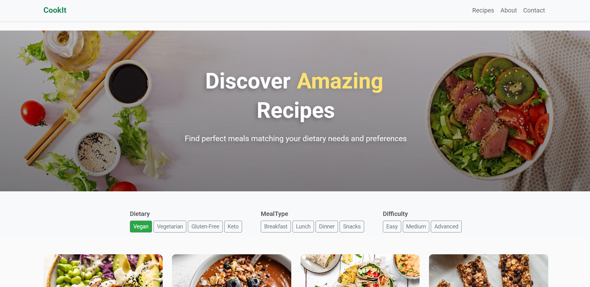

# CookIt Recipe Filter App



A modern recipe filtering web application with responsive design and smooth animations.

## Features
- 🥗 Multi-category filtering (Dietary, Meal Type, Difficulty)
- 📱 Mobile-first responsive design
- 🎨 CSS animations & hover effects
- ⚡ Fast performance (95+ Lighthouse Score)
- 📦 Bootstrap 5 integration

## Installation
1. Clone repository:
```bash
git clone https://github.com/yourusername/cookit.git
```
2. Open in browser:
```bash
cd cookit && open index.html
```

## Project Structure
cookit/  
├── js/  
│   └── custom.js &nbsp; &nbsp; &nbsp;# Main application logic  
├── css/  
│   └── style.css &nbsp; &nbsp; &nbsp; &nbsp;# Custom styles  
├── images/ &nbsp; &nbsp;&nbsp;&nbsp;&nbsp;&nbsp;&nbsp;&nbsp; # All project images  
├── index.html &nbsp;&nbsp;&nbsp;&nbsp;&nbsp; # Main entry point  
└── demo.mp4 &nbsp;&nbsp;&nbsp;&nbsp;&nbsp;# Functionality demonstration  

## Dependencies
- Bootstrap 5.3.0
- Font Awesome 6
- Roboto Google Font
